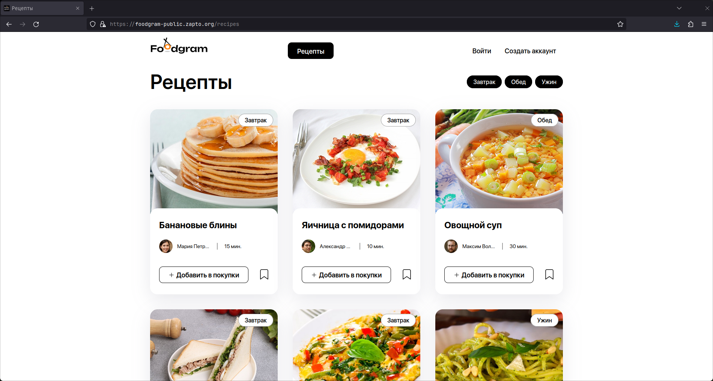
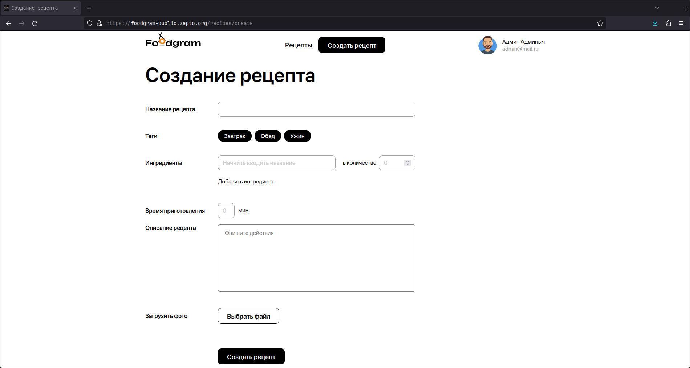
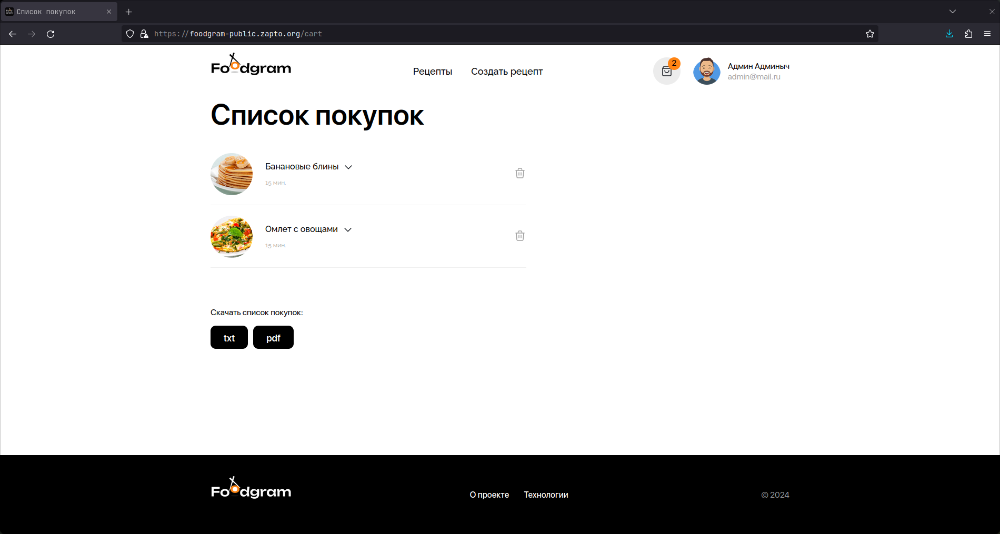

<p align="center">
  
</p>

Foodgram — это сайт для любителей готовить и делиться рецептами. Пользователи могут публиковать свои рецепты, добавлять чужие рецепты в избранное и подписываться на других авторов.

- [Запуск проекта](#запуск-проекта)
- [Возможности проекта](#возможности-проекта)
- [Примеры запросов к API](#примеры-запросов-к-api)
- [Используемые технологии](#используемые-технологии)

## Запуск проекта

Клонируйте репозиторий и перейдите в папку с проектом:

```bash
git clone https://github.com/vernette/foodgram
cd foodgram
```

Создайте виртуальное окружение и активируйте его:

```bash
python -m venv venv
source venv/bin/activate
```

Установите зависимости:

```bash
pip install -r backend/requirements.txt
```

Создайте файл `.env` в корне проекта и внесите свои данные. Для примера можно воспользоваться файлом `.env.example`:

```plaintext
POSTGRES_DB=foodgram
POSTGRES_USER=foodgram_user
POSTGRES_PASSWORD=foodgram_password
DB_HOST=db
DB_PORT=5432
DJANGO_SECRET_KEY=django-insecure-123
DJANGO_DEBUG=False
```

`DJANGO_SECRET_KEY` можно не заполнять вручную, так он будет сгенерирован автоматически.

Перейдите в директорию `infra` и запустите оркестр:

```bash
cd infra
sudo docker compose up
```

Импортируйте в проект заготовленные данные. Для этого перейдите в директорию `backend/foodgram` и выполните команду:

```bash
cd ../backend/foodgram
python manage.py import_ingredients_from_csv ../../data/ingredients.csv # Для импорта из csv
python manage.py import_ingredients_from_json ../../data/ingredients.json # Для импорта из json
```

## Возможности проекта

### Общая структура

Проект состоит из следующих страниц: 

- главная
- страница входа
- страница регистрации
- страница рецепта
- страница пользователя
- страница подписок
- избранное
- список покупок
- создание и редактирование рецепта
- страница смены пароля
- статические страницы «О проекте» и «Технологии».



### Страница создания рецепта

Эта страница доступна только для залогиненных пользователей. Все поля на ней обязательны для заполнения.



Также пользователь может отредактировать любой рецепт, который он создал.

### Страница списка покупок

Пользователь может скачать свой список покупок в формате `txt` и `pdf`. Ингредиенты из разных рецептов в списке покупок суммируются. 



### Разграничение прав пользователей

| Возможности неавторизованных пользователей | Возможности авторизованных пользователей                                                                                                                          | Возможности администратора                              |
|--------------------------------------------|-------------------------------------------------------------------------------------------------------------------------------------------------------------------|---------------------------------------------------------|
| Просмотр рецептов на главной               | Вход в систему под своим логином и паролем                                                                                                                        | Все права авторизованного пользователя                  |
| Просмотр отдельных страниц рецептов        | Выход из системы                                                                                                                                                  | Изменение пароля любого пользователя                    |
| Просмотр страниц пользователей             | Создание, редактирование и удаление собственных рецептов                                                                                                          | Создание, блокировка и удаление аккаунтов пользователей |
| Создание аккаунта                          | Просмотр страниц пользователей                                                                                                                                    | Редактирование и удаление любых рецептов                |
|                                            | Просмотр отдельных страниц рецептов                                                                                                                               | Добавление, удаление и редактирование ингредиентов      |
|                                            | Просмотр рецептов на главной                                                                                                                                      | Добавление, удаление и редактирование тегов             |
|                                            | Фильтрация рецептов по тегам                                                                                                                                      |                                                         |
|                                            | Работа с персональным списком покупок: добавление и удаление любых рецептов, выгрузка файла с количеством необходимых ингредиентов для рецептов из списка покупок |                                                         |
|                                            | Работа с персональным списком избранного: добавление в него рецептов или удаление их, просмотр своей страницы избранных рецептов                                  |                                                         |
|                                            | Подписка на публикации авторов рецептов и отмена подписки, просмотр своей страницы подписок                                                                       |                                                         |


## Примеры запросов к API

### Регистрация пользователя

```http
POST /api/auth/users/
Content-Type: application/json

{
  "email": "vpupkin@yandex.ru",
  "username": "vasya.pupkin",
  "first_name": "Вася",
  "last_name": "Иванов",
  "password": "Qwerty123"
}
```

### Получение токена

```http
POST /api/auth/token/login/
Content-Type: application/json

{
  "password": "string",
  "email": "string"
}
```

### Получение списка рецептов

```http
GET /api/recipes/
```

Полная документация доступна по [ссылке](https://foodgram-public.zapto.org/api/docs/).

## Используемые технологии

| Тип        | Название   |
|------------|------------|
| Веб-сервер | Nginx      |
| Бэкенд     | Django     |
| Фронтенд   | React      |
| БД         | PostgreSQL |

## Автор

- [Никита Скрябин](https://github.com/vernette)
